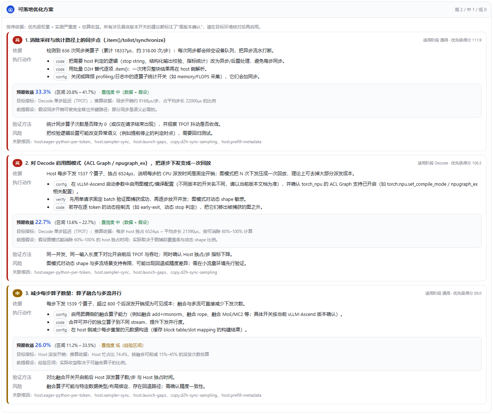

# vLLM-Ascend Profiler Analyzer

一个 DeepSeek Harness 插件（DSH plugin）：上传 vLLM-Ascend / 昇腾 NPU 的 profiling 产物，自动完成**文件校验 → 流式解析 → 独立可视化页面（三大模块）→ 结构化性能优化建议 → Markdown/PDF 报告导出**。

分析结论不是"看一眼就下的判断"：每一句结论都能追溯到具体指标、门限、产物字段与推算公式，并且区分 **Prefill** 与 **Decode** 两类负载。插件本身**零运行时依赖**（只用 Node 内置模块与浏览器原生 API，不打包任何第三方前端库）。

```
插件页面：http://127.0.0.1:<port>/vllm-ascend-profiler/
```

---

## 1. 它解决什么问题

昇腾上的 vLLM 推理变慢时，常见疑问是"到底是 Host 调度、NPU 计算、跨卡通信，还是 H2D/D2H 拷贝拖慢的？"。CANN 与 torch_npu 会导出大量产物（trace_view.json、kernel_details.csv、op_statistic.csv、step_trace_time.csv …），但这些产物本身有若干"坑"：

* `trace_view.json` 是**裸 JSON 数组**（不是 `{"traceEvents": [...]}`）、`ts` 是**十进制字符串**、导出中断时甚至缺少收尾括号；
* Host/Device 不是靠 `pid == "Host"` 区分的，而是靠 `process_name` 元数据（`Python` / `CANN` / `Ascend Hardware`）；
* CSV 表头在不同 CANN 版本之间漂移（`Start Time(us)` vs `Task Start Time(us)`、`Type` vs `OP Type`、`Accelerator Core`）；
* `step_trace_time.csv` 表头不声明单位，实际写的是毫秒；
* **Prefill/Decode 阶段在产物里基本没有标签**（唯一例外是 `step_trace_time.csv` 的 `Stage` 列）。

本插件把这些全部处理掉，并输出一份既能拿去开会、也能直接照着改配置的报告。这些结论不是猜的：解析器对目录结构、表头与命名约定的假设都记录在 [`docs/research/`](docs/research/)（每条带官方文档/源码引用）。

---

## 2. 安装

插件是**零依赖的纯 ESM 包**，只需要让 DSH profile 能解析到它。

### 方式 A：从 GitHub 安装（需要 pnpm）

```powershell
dsh plugin --profile web add github:nutsDad/dsh-plugin-vllm-ascend-profiler
```

`dsh plugin` 会在 profile 目录执行 pnpm 安装，并因为本包声明了 `dsh.bundle.patch` 而**自动**把 `dsh-plugin-vllm-ascend-profiler` 追加进 `dsh.profile.bundles`。本包没有任何依赖、也没有 `prepare`/构建脚本，因此不需要 `allowBuilds` 放行。重启 profile 即可生效。

### 方式 A2：从本地目录安装（开发时）

```powershell
dsh plugin --profile web add file:D:\path\to\dsh-plugin-vllm-ascend-profiler
```

### 方式 B：手工安装（没有 pnpm 时）

1. 在 profile 目录建立链接（Windows 用 junction，Unix 用 symlink）：

```powershell
$profile = "$env:DSH_HOME\profiles\web"
New-Item -ItemType Junction `
  -Path "$profile\node_modules\dsh-plugin-vllm-ascend-profiler" `
  -Target "D:\path\to\dsh-plugin-vllm-ascend-profiler"
```

2. 编辑 `$env:DSH_HOME\profiles\web\package.json`（**注意不要写成带 BOM 的 UTF-8**，否则 DSH 读取清单会直接报 `SyntaxError`）：

```json
{
  "dependencies": {
    "dsh-plugin-vllm-ascend-profiler": "file:D:/path/to/dsh-plugin-vllm-ascend-profiler"
  },
  "dsh": {
    "profile": {
      "bundles": ["@deepseek-ai/dsh-base", "@deepseek-ai/dsh-web-app", "dsh-plugin-vllm-ascend-profiler"],
      "patchReload": "live"
    }
  }
}
```

3. 重启 `dsh --profile web`。启动日志会出现：

```
vllm-ascend-profiler: 分析页面位于 /vllm-ascend-profiler/（trace 解析、可视化与报告导出）
```

### 方式 C：只验证一个独立 profile（不影响正在使用的 GUI）

```powershell
$env:DSH_HOME = "D:\tmp\.dsh-test"
dsh --profile demo --from-default-profile web --port 3099 --no-open
```

### 卸载

从 `dsh.profile.bundles` 中删除本包名（并删掉依赖与链接）即可完全卸载；插件不写任何持久化文件、不注册任何后台任务。

---

## 3. 使用

### 3.1 打开页面

* 侧边栏底部新增入口 **「Profiler 分析」**（浏览器半注册在 `sidebar.footer.action` 插槽，点击在新标签页打开分析页面）；
* 或直接访问 `http://127.0.0.1:<port>/vllm-ascend-profiler/`。

### 3.2 导入产物

三种方式，任选：

| 方式 | 适用场景 | 说明 |
| --- | --- | --- |
| 拖拽/多选上传 | 常规 CSV + 中小 trace | 多个文件作为**一个数据集**依次上传，页面显示字节级上传进度 |
| 打包上传 | `*_ascend_pt` 目录整体 | 支持 `.zip` / `.tar.gz`（内存内解压，成员大小与数量有上限） |
| **按路径分析** | GB 级 `trace_view.json` | 服务端**流式**读取，不占上传带宽；默认限制在会话工作区内 |

### 3.3 解析进度

解析是异步任务：页面轮询任务状态并显示「校验 → 解析 → 汇总 → 分析」四段进度与明细日志。大 trace **不会卡死页面**：事件按预算做等距采样（通信/拷贝/长耗时算子**全量保留**），采样情况在页面与报告中明确标注。

### 3.4 三大模块

**模块一 · Host / Device 算子执行泳道图**

* 两组泳道：`Host（CPU）` 与 `Device（昇腾 NPU）`，组内**每个算子一行**（默认按累计耗时降序，可切换调用次数 / 算子名 / 单次最长，行数可调 30/60/120/240）；
* X 轴为时间轴（自动按 µs/ms/s 选单位），每根算子条是一次调用：起点=开始时间，宽度=持续时长；
* 颜色区分**通信 / 计算 / 数据拷贝 / 调度 / 其他**五类，图例即筛选器；
* 交互：`滚轮`滚动行、`Ctrl/⌘ + 滚轮`以光标为中心缩放、`Shift + 滚轮`或拖拽平移、`双击`重置、**悬停**显示算子卡片（算子名、开始时间、耗时、调用次数、累计/均值/p95/最长、输入输出 shape、OP/Task Type、调用栈、rank/stream）、**点击算子条**筛选该算子、Host/Device 泳道可单独隐藏；
* 视图抽样会明确显示「本行显示 N/M 个算子条」，累计耗时统计**不受**视图抽样影响。

**模块二 · 算子耗时占比**

* 左：**环形饼图**——按算子大类汇总，口径可切「设备侧 / 全部 / Host 侧」；
* 右：**TopN 降序条形图**——绝对耗时 + 占算子总耗时百分比，N 可调 10/20/30/50；
* **维度切换**：`单次执行耗时`（均值，找"单次就很慢"的算子）↔ `累计总耗时`（找"次数多、总量大"的算子）；
* 下方数据表给出调用次数、累计、均值、p95、占比与**总计来源**（trace 聚合 / CANN 统计表）及 cross-check 偏差。

**模块三 · 结构化性能优化建议**

固定推理链路，五步全部展示（不省略中间推理）：

1. **瓶颈类型定位**：四类候选（Host 调度 / NPU 计算 / 跨卡通信 / 数据拷贝）分别打分 0–100，标注是否达到门限，并给出"未达门限项"的原因；全量窗口与 Prefill / Decode 阶段**分别判定**；
2. **量化证据**：每个指标的实测值、门限、比较式、数据来源（可展开「判定依据（N 项证据）」）；
3. **根因推断**：结合 vLLM-Ascend 实现原理给出机理、触发数据与现场确认方法；
4. **可落地优化方案**：按 高/中/低 优先级排序，含具体动作、依据、验证方法、风险；涉及版本相关开关的会标注"需版本确认"；
5. **预期收益**：能用本数据集推算的给出推算过程与区间，不能推算的明确标注为**经验区间**，并说明多项优化的收益不可简单相加。

### 3.5 阶段口径（Prefill / Decode）

页面「阶段口径」可切换 `自动推断 / 仅 Prefill / 仅 Decode` 并**重新分析**。由于昇腾产物默认没有阶段标签，推荐做法是：

* 分别采集 prefill-only 与 decode-only 两个窗口（`/start_profile` → 只发长 prompt → `/stop_profile`，再单独采 decode），然后在页面上直接指定阶段；
* 若无法分开采集，插件会按步长分布推断（log 空间双峰），并在报告中标注置信度与推断依据；`step_trace_time.csv` 的 `Stage` 列优先级最高。

### 3.6 导出报告

* **Markdown**：完整报告（含 ①–⑤ 全链路、门限比对明细、TopN 表、阶段指标、口径与告警）。若已导出过 PDF，图表快照会作为内嵌图片一并写入，文件自包含、可直接分发；
* **PDF**：页面先捕获**泳道图（完整采集窗口）**与**饼图/条形图**快照提交给服务端，然后打开打印优化版 HTML 并自动弹出打印对话框，选择"另存为 PDF"即可。不引入任何 PDF 库，保留矢量文字与可选中文本。

导出时若图表捕获失败（例如浏览器限制 canvas 导出），报告仍会正常生成，只在图表章节说明原因。

### 3.7 内置说明文档

页面顶部「说明文档」按钮，包含：指标定义与计算公式、口径注意事项、每个 profiling 产物（含字段表头）的用途与陷阱、快速开始与性能提示。同样的内容以 Markdown 形式保存在 [`docs/metrics-and-fields.md`](docs/metrics-and-fields.md)。

### 3.8 界面预览

截图由 [`tools/capture-page.mjs`](tools/capture-page.mjs) 通过 DevTools 协议驱动无头浏览器生成（等三模块真正渲染完成后再截图）。数据为 `test/fixtures/host-schedule-bound` 场景：35,713 个事件 / 21 个算子 / 20 个推理步，主导瓶颈 = Host 调度 97 分。

**导入区**（拖拽上传 / 按路径分析 / 阶段口径提示）


**数据集摘要**：8 个 KPI + 主导瓶颈横幅（含得分、作用范围、阶段划分来源与置信度）


**模块一 · Host/Device 算子执行泳道图**：Host 组（紫=调度、绿=拷贝）与 Device 组（蓝=计算、橙=通信），每个算子一行并标注「累计耗时 × 调用次数」


**模块二 · 算子耗时占比**：环形饼图（大类占比）+ TopN 降序条形图


**模块三 · ① 瓶颈类型定位**：四类候选分别打分并标注是否达门限，全量窗口与 Prefill/Decode 阶段独立判定


**模块三 · ④ 优化方案**（按优先级排序，含依据/动作/验证/风险）与 **⑤ 预期收益**




完整页面长图见 [`docs/screenshots/08-full.png`](docs/screenshots/08-full.png)，深色主题见 [`docs/screenshots/09-dark-share.png`](docs/screenshots/09-dark-share.png)。重新生成：

```powershell
# 1) 启动一个带插件的临时实例（见 §2 方式 C），并让它持有若干数据集
# 2) 启动带调试端口的无头浏览器
msedge --headless=new --disable-gpu --user-data-dir=D:\tmp\edge --remote-debugging-port=9222 about:blank
# 3) 抓图（等待渲染 → 逐区域截图）
node tools/capture-page.mjs --url http://127.0.0.1:3099/vllm-ascend-profiler/ --out docs/screenshots --port 9222
```

---

## 4. 插件结构（符合 DSH 插件规范）

```
dsh-plugin-vllm-ascend-profiler/
├── package.json                 # 插件声明：main（host 半）+ exports["./client"]（browser 半）
│                                #   dsh.bundle.patch → cordis.patch.yml
│                                #   dsh.client { platform: "web" } → 被 dsh-client-modules 发现
├── cordis.patch.yml             # bundle patch：插入 id=vllm-ascend-profiler 的宿主行（含 config）
├── lib/
│   ├── index.js                 # 【宿主插件】路由注册、上传/任务/数据集、报告导出、索引注入
│   ├── client.js                # 【浏览器插件】手写 DSH client module，注册侧边栏入口
│   ├── http.js                  # 有界请求体读取、JSON/静态文件响应、限流日志
│   ├── store.js                 # 任务与数据集的内存存储（TTL + 容量上限）
│   ├── view.js                  # 视图模型投影（事件预算、行预算、契约稳定）
│   ├── docs.js                  # 指标口径 / 产物字段 / 使用说明内容
│   ├── parse/                   # ── 文件解析层
│   │   ├── sniff.js             # 产物识别与校验（证据权重、明确报错）
│   │   ├── archive.js           # zip / tar / gzip 内存解压（有界）
│   │   ├── jsonstream.js        # 流式 JSON 扫描器（裸数组、截断容忍、逐元素回调）
│   │   ├── trace.js             # Chrome trace 解析（Host/Device、B/E/M 事件、单位推断、采样）
│   │   ├── ascendcsv.js         # CANN/torch_npu CSV 解析（表头别名、单位、利用率列）
│   │   ├── csv.js               # CSV 词法（引号、BOM、分隔符、编码回退）
│   │   ├── protobuf.js          # proto/binary 通用 wire 解码 + 字段映射 + 启发式识别
│   │   └── index.js             # 解析编排、目录遍历、进度上报
│   ├── model/                   # ── 数据预处理层
│   │   ├── classify.js          # 算子分类（计算/通信/拷贝/调度）+ 名称归一
│   │   ├── dataset.js           # 数据集构建（泳道、聚合、重叠、空闲、利用率、排名）
│   │   ├── phase.js             # 步骤提取 + Prefill/Decode 归属（含置信度）
│   │   └── stats.js             # 区间并集/重叠、分位数、双峰切分
│   ├── analysis/                # ── 性能分析推理层
│   │   ├── index.js             # 五步链路编排（含阶段作用域与去重）
│   │   ├── bottleneck.js        # ① 定位 + ② 证据（门限打分）
│   │   ├── rootcause.js         # ③ 根因假设（vLLM-Ascend 机理库）
│   │   ├── recommend.js         # ④ 方案 + ⑤ 预期收益
│   │   └── thresholds.js        # 全部门限常量 + 取值依据
│   └── report/
│       ├── markdown.js          # Markdown 报告
│       └── print.js             # 打印/PDF 版 HTML
├── web/                         # 独立可视化页面（原生 Canvas/SVG，无第三方前端依赖）
│   ├── index.html               # 三大模块 + 导入区 + 说明文档
│   ├── styles.css               # 明暗主题（prefers-color-scheme）
│   ├── util.js  api.js          # 工具与 API 客户端（XHR 上传进度）
│   ├── gantt.js                 # 模块一：Canvas 泳道时序图
│   ├── charts.js                # 模块二：环形饼图 + 排序条形图 + 数据表
│   ├── advice-view.js           # 模块三：五步链路渲染
│   ├── docs-view.js             # 说明文档渲染
│   └── app.js                   # 页面控制器
├── docs/
│   ├── metrics-and-fields.md    # 指标含义 + profiling 字段说明
│   ├── analysis-logic.md        # 分析推理链、门限表、收益推算公式
│   ├── research/                # 产物格式调研（带官方文档/源码引用）
│   └── screenshots/             # 界面截图
├── tools/capture-page.mjs       # 开发工具：DevTools 协议驱动无头浏览器抓图
└── test/                        # 69 个用例 + 场景夹具生成器 + 真实 trace 夹具
```

### 数据流

```
上传/路径 → 解压展开 → sniff 识别校验（不合格直接明确报错）
        → trace/CSV/proto 解析（流式 + 采样，进度上报）
        → buildDataset（分类、归一、泳道、聚合、阶段、重叠、空闲、利用率）
        → analyzeDataset（① 定位 ② 证据 ③ 根因 ④ 方案 ⑤ 收益）
        → buildViewModel（事件/行预算投影）→ 页面三模块
        → 报告导出（Markdown / 打印 HTML）
```

### 插件声明要点

* **宿主行**：`cordis.patch.yml` 插入 `id: vllm-ascend-profiler`，`inject: ['webServer']` 后注册**一个**前缀路由 `/vllm-ascend-profiler`，其下再分发页面、静态资源与 API；
* **浏览器半**：`package.json` 的 `dsh.client` + `exports["./client"]`，被 `@deepseek-ai/dsh-client-modules` 扫描进 `window.__DSH_BOOT__`，通过 `/plugins/<id>/client.js` 提供；宿主半还会向 shell 注入 `__VLLM_ASCEND_PROFILER__` 全局，因此浏览器半无需重复配置路由前缀；
* **降级安全**：浏览器半只注册一个 UI 入口，且对 `ctx.slots` 缺失/异常做了保护——即使未来 shell 移除该插槽，也只会打印一条告警，不会导致浏览器启动失败；
* **可配置项**（见 `cordis.patch.yml` 注释）：路由前缀、上传/内存上限、事件与行预算、数据集容量与 TTL、是否允许按路径分析、是否允许工作区外路径、峰值算力（把 FLOPs 换算成算力利用率）、proto 字段号映射（`protoFieldMap`）、多 rank 对齐方式、TopN、门限覆盖。

---

## 5. 支持的产物

| 产物 | 产出方 | 用途 |
| --- | --- | --- |
| `trace_view.json` | torch_npu Ascend PyTorch Profiler | 泳道图与事件级聚合（Host + Device） |
| `kernel_details.csv` | torch_npu | 设备侧 kernel 明细 + AI Core 流水指标（mac/mte*_ratio） |
| `operator_details.csv` | torch_npu | Host/Device 双侧算子耗时（Self/Total） |
| `op_statistic.csv` | torch_npu / msprof-analyze | 算子聚合统计（交叉校验） |
| `op_summary*.csv` | msprof / MindStudio | 算子实例明细（Task Type / Accelerator Core / Block Num） |
| `step_trace_time.csv` | torch_npu | 逐步 Computing/Communication/Free 分解 + `Stage` 阶段列 |
| `api_statistic.csv` | torch_npu / msprof-analyze | Host API 统计（计入 Host 调度开销） |
| `communication.json` / `communication_matrix.json` | msprof-analyze | 集合通信统计与矩阵 |
| `profiler_info_{Rank}.json` | torch_npu | 采集元数据（设备、rank、并行、版本） |
| `*.proto` / `*.bin` | CANN | 通用 wire 解码 + 启发式事件提取（置信度低，可用 `protoFieldMap` 精确映射）；未分帧的连续记录只提取首个可识别记录并明确告警 |
| `analysis.db` / `msprof_*.db` | torch_npu / msprof | **不直接解析**，提示用 msprof-analyze 导出 CSV |
| `.zip` / `.tar.gz` | 用户打包 | 内存内展开，成员大小与数量有上限 |

不兼容文件会给出**明确报错**（而不是空白图表），例如：

```
文件证据不足以判定为 vLLM-Ascend profiling 产物（累计证据权重 2 < 4）。
期望的产物包括：torch_npu 的 trace_view.json、kernel_details.csv、operator_details.csv、op_statistic.csv，
或 msprof 的 op_summary.csv / step_trace_time.csv，或上述文件所在的 *_ascend_pt 目录。
```

---

## 6. 测试与验证

```powershell
node test/make-fixture.mjs      # 生成三个场景夹具（decode 通信受限 / prefill 计算受限 / Host 调度受限）
node test/all.test.mjs          # 运行全部用例（单进程，避免沙箱下的进程派生限制）
# 或分文件运行：
node test/parse-primitives.test.mjs   # CSV 词法 + 流式 JSON 扫描器 + 分类优先级
node test/protobuf.test.mjs           # proto wire 解码、字段映射、启发式识别与降级
node test/pipeline.test.mjs           # 真实 Ascend trace 片段（裸数组 + 十进制字符串 ts + 截断文件）
node test/analysis.test.mjs           # 三种瓶颈场景的定位/根因/方案/收益 + 报告渲染
node test/http.test.mjs               # 宿主 API 全流程（上传、路径、进度、导出、校验失败、越权、图表快照）
node test/web-dom.test.mjs            # 前端三模块真实渲染 + 控制器 init + CSS/ID 一致性
node test/client-bundle.test.mjs      # 浏览器插件包的加载、注册与降级
```

当前状态：**69 个用例全部通过**（CI 在 Node 22 与 24 上跑同一套，见 [`.github/workflows/test.yml`](.github/workflows/test.yml)）。

值得说明的验证强度：

* 测试夹具包含一份**真实** Ascend trace 的截断前缀（来自 Ascend/mstt，见 [`test/fixtures/README.md`](test/fixtures/README.md)），而不是全靠自造数据；
* 三个场景夹具分别对应三类瓶颈，测试断言"**定位结论必须正确**"（通信/计算/Host 各自成为主导瓶颈），而不是只断言"没报错"；
* 前端有一个自建的最小 DOM 环境，能真正跑 `init()` 与三个渲染器——这套测试在开发中抓到了"控制器缓存了不存在的元素 id 导致整页不渲染""中文类名导致建议卡片退化成未知元素"这类只有真实渲染才会暴露的问题；
* 端到端验证做过真实 DSH 启动：独立 profile 装载插件后，页面/静态资源/健康检查全部 200，浏览器半被 client-modules 收进 `__DSH_BOOT__` 并从 `/plugins/??<id>/client.js` 成功加载，宿主注入的 `__VLLM_ASCEND_PROFILER__` 出现在 shell 索引中；`POST /api/jobs`（按路径）解析 35,713 事件 → 报告导出 Markdown 43KB + 打印版 52KB（含图表快照）。

---

## 7. 已知边界

* **阶段标签**：Ascend 产物默认不含 Prefill/Decode 标签（`step_trace_time.csv` 的 `Stage` 除外）。未分开采集时，阶段划分为推断结果，报告中标注置信度；建议按 §3.5 分开采集。
* **大 trace**：解析阶段按事件预算等距采样，视图阶段再按行预算投影；两者都会在页面与报告里说明，累计耗时优先取 CANN 统计表以保证占比可信。
* **绝对时间不混轴**：CSV 的 `Start Time` 是设备绝对时间，trace 的 `ts` 是相对时间，二者不做同轴绘制；聚合按统一单位合并并给出 cross-check 偏差。
* **proto 解析**：Ascend proto 无自描述 schema，默认启发式识别（低置信度），可用 `protoFieldMap` 精确指定字段号。
* **路由暴露**：分析页面与其 API 位于 webserver 的公开路径下（与前端静态资源同级）。DSH webserver 默认绑定 `127.0.0.1`，因此仅本机可访问；若把 `--host` 暴露到网络，请自行加访问控制。
* **收益估算**：由本数据集推导的收益给出推算过程；标注为"经验区间"的项（如量化加速比）不得当作承诺值。
* **不写盘**：上传内容仅在内存中解析，解析完成后释放；数据集按空闲 TTL（默认 1 小时）过期。因此 GB 级产物推荐"按路径分析"。

---

## 8. 文档索引

* [`docs/metrics-and-fields.md`](docs/metrics-and-fields.md) — 指标含义、计算公式、口径边界，以及每个 profiling 产物的字段说明
* [`docs/analysis-logic.md`](docs/analysis-logic.md) — 五步推理链、全部门限取值依据、收益推算公式、如何提高结论可信度
* 产物格式调研附录（解析器假设的来源，每条结论带官方文档/源码引用）：
  * [`docs/research/ascend-profiling-artifact-formats.md`](docs/research/ascend-profiling-artifact-formats.md) — 两类产物（Ascend PyTorch Profiler 与原生 msprof）的目录与文件清单、CSV 表头、trace 结构、陷阱
  * [`docs/research/hccl-memcpy-profiling-report.md`](docs/research/hccl-memcpy-profiling-report.md) — HCCL 通信与 memcpy 的算子命名、`Task Type` 取值、字段级参考
  * [`docs/research/hccl-research-notes.md`](docs/research/hccl-research-notes.md) — 上述结论的原始调研记录（含源码位置）
* [`test/fixtures/README.md`](test/fixtures/README.md) — 测试夹具的来源与第三方素材授权说明

---

## 9. 许可

MIT，见 [`LICENSE`](LICENSE)。运行时不打包任何第三方代码（零依赖，只用 Node 内置模块与浏览器原生 API）；仓库内仅有一份第三方测试夹具（来自 Apache-2.0 的 Ascend/mstt），来源与授权说明见 [`THIRD-PARTY-NOTICES.md`](THIRD-PARTY-NOTICES.md)。
